## Nama    : Mohammad Sofiyan 
## kelas   : TI20.A2
## Matkul  : Pemrograman web


## langkah pertama 
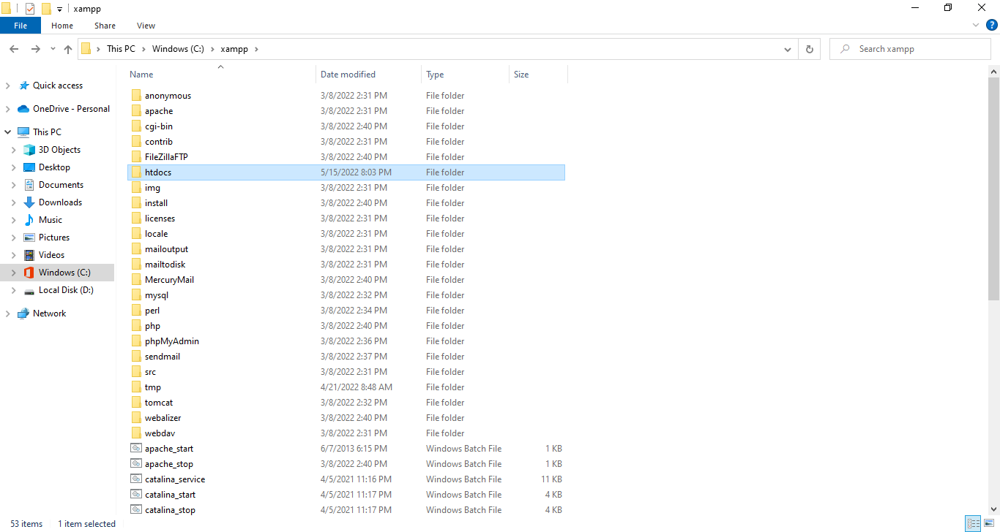
Menginstal xampp

## langkah kedua 
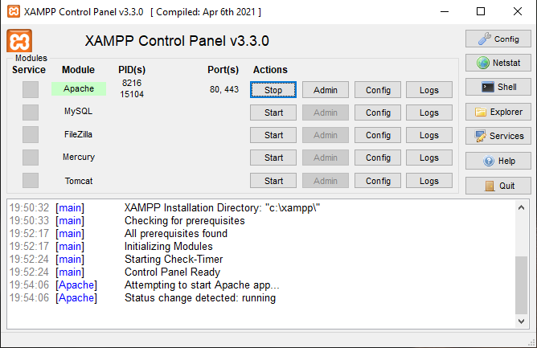
Menjalankan xampp 

## langkah ketiga 
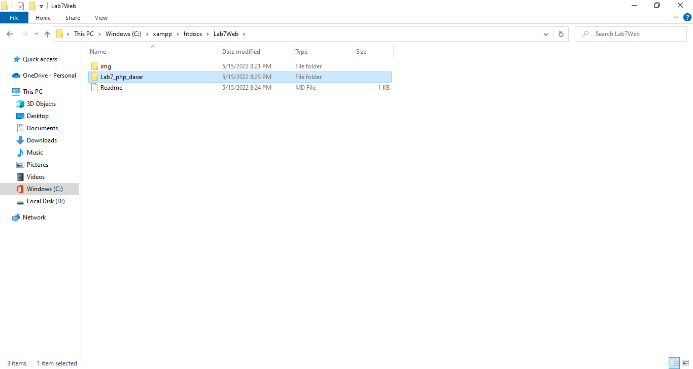
Memulai php pada folder

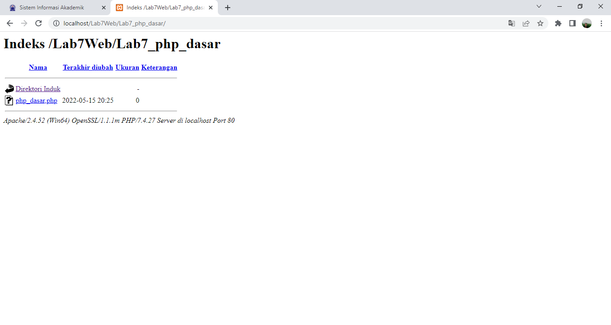
Membuka Localhost

## langkah keepat
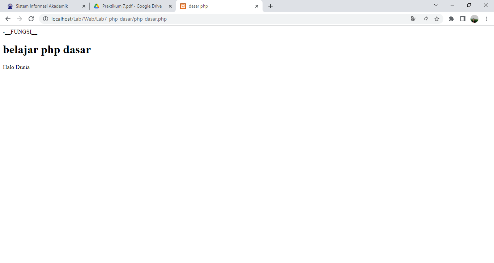
Pariabel pada php
```php
<?php
echo "Hello World";
?>
```
## langkah kelima
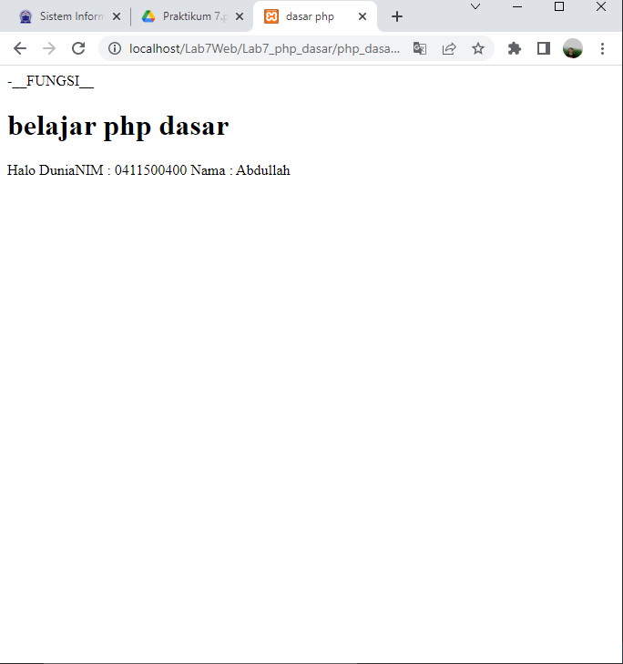
Memanggil paraibel
```php
<?php
$nim = "0411500400";
$nama = 'Abdullah';
echo "NIM : " . $nim . "<br>";
echo "Nama : $nama";
?>
```
## langkah keenam
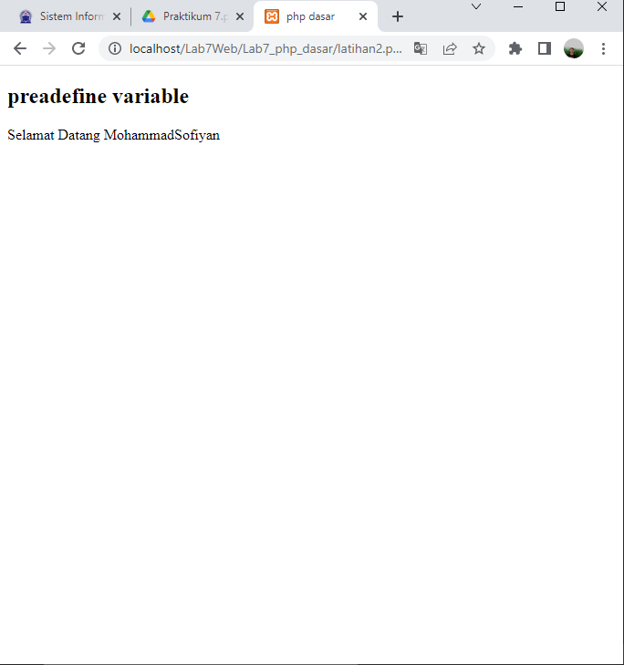
deklarasi preadenfine variable
```php
<?php
echo 'Selamat Datang ' . $_GET['nama'];
?>
```
## langkah ketujuh
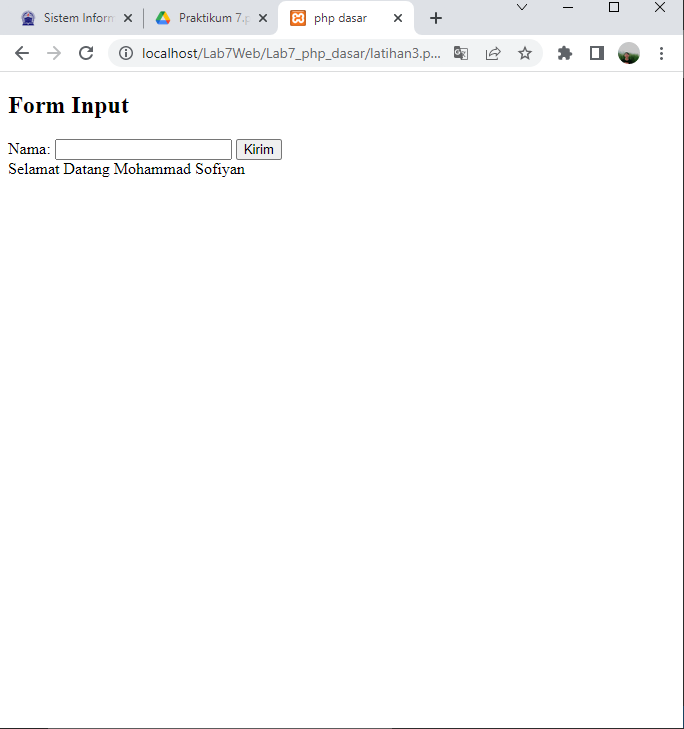
Membuat form input
```php
<!DOCTYPE html>
<html lang="en">
<head>
    <meta charset="UTF-8">
    <meta http-equiv="X-UA-Compatible" content="IE=edge">
    <meta name="viewport" content="width=device-width, initial-scale=1.0">
    <title>php dasar</title>
</head>
<body>
<h2>Form Input</h2>
<form method="post">
<label>Nama: </label>
<input type="text" name="nama">
<input type="submit" value="Kirim">
</form>
<?php
echo 'Selamat Datang ' . $_POST['nama'];
?>
</body>
</html>
```
## langkah kedelapan
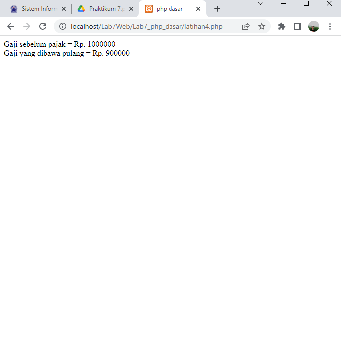
oprator pada php
```php
<?php
$gaji = 1000000;
$pajak = 0.1;
$thp = $gaji - ($gaji*$pajak);
echo "Gaji sebelum pajak = Rp. $gaji <br>";
echo "Gaji yang dibawa pulang = Rp. $thp";
?>
```
## langkah kesembilan 

Kondisi IF else pada perogram php
```php
<?php
$nama_hari = date("l");
if ($nama_hari == "Sunday") {
echo "Minggu";
} elseif ($nama_hari == "Monday") {
echo "Senin";
} else {
echo "Selasa";
}
?>
```
## langkah kesepuluh
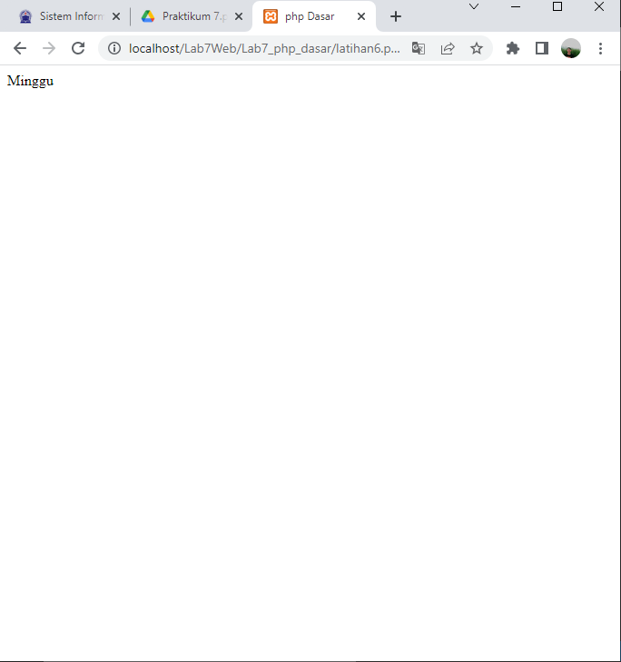
kondisi swit pada perogram php
```php
<?php
$nama_hari = date("l");
switch ($nama_hari) {
case "Sunday":
echo "Minggu";
break;
case "Monday":
echo "Senin";
break;  
case "Tuesday":
    echo "Selasa";
    break;
    default:
    echo "Sabtu";
}
    ?>
```
## langkah kesebelas 
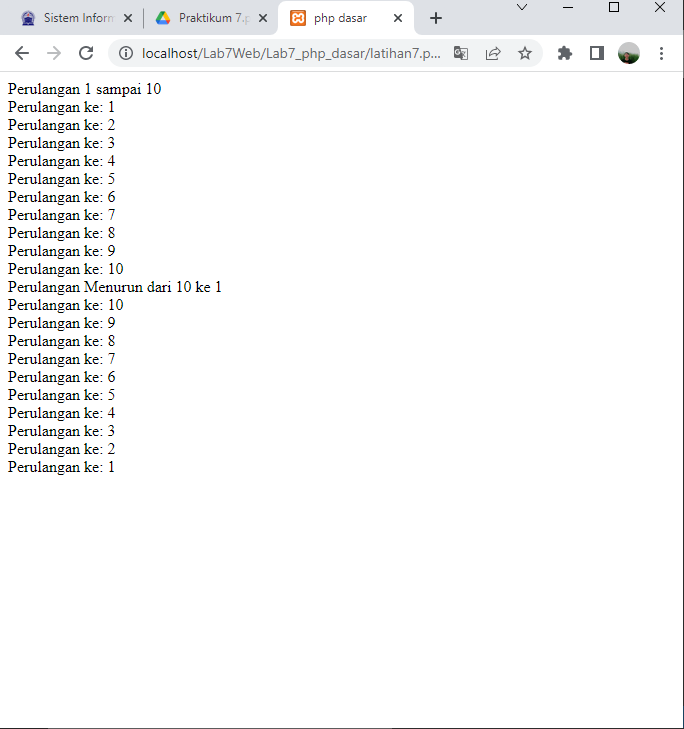
perulangan for pada php
```php
<?php
echo "Perulangan 1 sampai 10 <br />";
for ($i=1; $i<=10; $i++) {
echo "Perulangan ke: " . $i . '<br />';
}
echo "Perulangan Menurun dari 10 ke 1 <br />";
for ($i=10; $i>=1; $i--) {
echo "Perulangan ke: " . $i . '<br />';
}
?>
```
## langkan keduabelas 
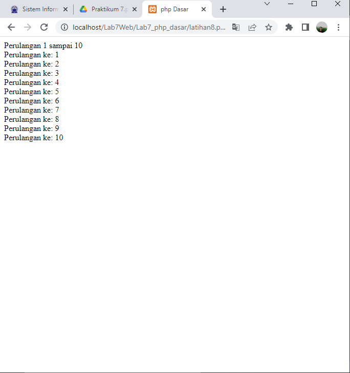
pengulangan while pada php
```php
<?php
echo "Perulangan 1 sampai 10 <br />";
$i=1;
while ($i<=10) {
echo "Perulangan ke: " . $i . '<br />';
$i++;
}
?>
```
## langkah ketigabelas

perulangan dowhile pada php 
```php 
<?php
echo "Perulangan 1 sampai 10 <br />";
$i=1;
do {
echo "Perulangan ke: " . $i . '<br />';
$i++;
} while ($i<=10);
?>
```